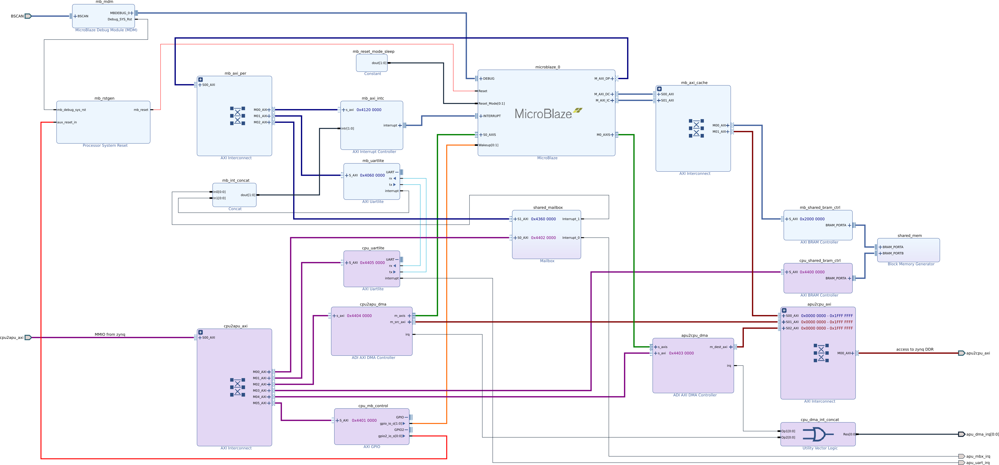

# Microblaze Application Processor Unit for Dexter

## Startup / Reset
The Microblaze CPU is configured to start suspended. This means it will immediately halt after reset until it is woken
up by one of the wake-up pins.
The wake-up pins are exclusively controlled from the Zynq CPU over the cpu_mb_control GPIO block.
The reset pin is connected to a reset generator which in turn is controlled by various reset sources.
One of the reset sources is also connected to the Zynq CPU over the cpu_mb_control GPIO block.

## Program download
To download a program, hold the Microblaze in reset until ready to launch, download the program and then release the
reset and start the execution via the wake-up control.

## Loader application
The `load_apu` tool can load a Microblaze binary image to the block ram and start it.
The projects contains the mbox companion app for the Zynq and the Microblaze.

## Memory Maps
### Microblaze
| Address       | Size | Peripheral           |
| ------------- | ---- | -------------------- |
| `0x0000 0000` | 512M | Zynq main memory     |
| `0x2000 0000` | 16k  | Shared block ram     |
| `0x4060 0000` | 64k  | uartlite to Zynq     |
| `0x4120 0000` | 64k  | interrupt controller |
| `0x4360 0000` | 64k  | Shared mailbox       |

### Zynq
| Address       | Size | Peripheral         |
| ------------- | ---- | ------------------ |
| `0x0000 0000` | 512M | Zynq main memory   |
| `0x4400 0000` | 16k  | Shared block ram   |
| `0x4401 0000` | 64k  | Control GPIO       |
| `0x4402 0000` | 64k  | Shared mailbox     |
| `0x4403 0000` | 64k  | AXI DMA MB -> Zynq |
| `0x4404 0000` | 64k  | AXI DMA Zynq -> MB |
| `0x4405 0000` | 64k  | uartlite to MB     |

## Vectors
C_BASE_ADDRESS in the CPU configuration is set to `0x2000 0000` which in turn puts all vectors in the block ram.

## System overview


### Mailbox demo
#### Watch UART output
```
root@analog:~# cat /dev/ttyUL0
```

#### Load the program
```
root@analog:~# ./load_apu -f mbox.bin 
Page size: 4096 bytes
Assert APU Reset
Loading file mbox.bin
Downloading 5728 bytes
Release APU Reset
```

#### UART output
```
root@analog:~# cat /dev/ttyUL0
---Entering main---
XMbox_LookupConfig OK
XMbox_CfgInitialize OK
MailboxExample_Send OK
```

#### Start communication from Zynq
```
root@analog:~# ./mbox -rw
Page size: 4096 bytes
REG_MBOX_STATUS: 0x0000000c
REG_MBOX_ERROR:  0x00000000
REG_MBOX_SIT:    0x00000000
REG_MBOX_RIT:    0x00000000
REG_MBOX_IS:     0x00000002
REG_MBOX_IE:     0x00000000
REG_MBOX_IP:     0x00000000
mbox write....
   0: 6c6c6548 Hell
   4: 5420216f o! T
   8: 43206568 he C
  12: 75736e6f onsu
  16: 2072656d mer 
  20: 65657267 gree
  24: 74207374 ts t
  28: 50206568 he P
  32: 75646f72 rodu
  36: 00726563 cer.
Wrote 40 bytes
mbox read....
   0: 6c6c6548 Hell
   4: 5420216f o! T
   8: 50206568 he P
  12: 75646f72 rodu
  16: 20726563 cer 
  20: 65657267 gree
  24: 74207374 ts t
  28: 43206568 he C
  32: 75736e6f onsu
  36: 0072656d mer.
...done
```

#### UART output
```
root@analog:~# cat /dev/ttyUL0
---Entering main---
XMbox_LookupConfig OK
XMbox_CfgInitialize OK
MailboxExample_Send OK
MailboxExample_Receive OK
MailboxExample_Send OK
```
