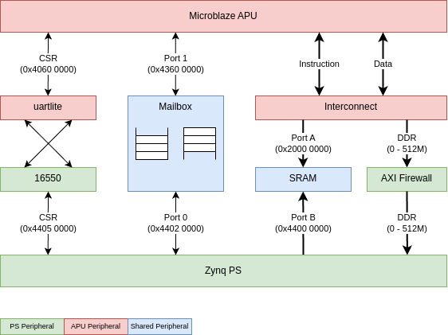

# Microblaze Application Processor Unit for Dexter

## System overview


Implementation details:
- [Block Design](./apu_v4.pdf)

### Microblaze core
The Microblaze core is fully featured for Applications: 32 bit core wit MMU and FPU.

#### Configuration
- Application Preset
- 32-Bit implementation

#### General settings
- Performance optimization
- Use I and D cache
- Enable Exceptions
- Use MMU

#### Instructions
- Barrel Shifter
- No FPU
- MUL64 integer multiplier
- Integer divider
- Additional MSR instructions
- Pattern comparator
- Reversed load/store and swap instructions

#### Exceptions
- Integer division exception
- I and D AXI BUS exceptions
- Illegal instruction exception
- Unaligned data exception
- Treat 0 as illegal instruction

#### Cache
- 32kB I Cache with line length of 8
- 32kB D Cache with line length of 4 and write-back policy

#### MMU
- Virtual Memory
- Shadow DTLB Size: 4
- Shadow ITLB Size: 2
- Access to MMU special registers: Full
- 2 Memory Protection Zones
- Full protection

#### Debug
- Extended debug module
- 2 PC break points
- 1 write address watch points
- 1 read address watch points
- 5 performance monitor event counters (64-Bit)
- 1 performance latency counter  (64-Bit)
- 8 kB Trace Buffer
- 4 kB Profile Buffer

#### Buses
- Peripheral Data AXI
- *I/D-Cache AXI*
- 0 Stream link

### Interfaces
#### UART
The UART is the simplest communication interface in the system.
It's a simple uartlite on the APU side and an 16550 serial port on the CPU side.
It runs with a fixed bad rate of 115200 and is suitable for debug output.

#### Mailbox
The mailbox is a more elaborate way for data exchange. It is intended for synchronization of two independent running
systems. It is basically two FIFOs with control logic on either side.

#### Timer
An AXI timer with interrupt was added for timing purposes.

#### Timestamp counter
An 48-Bit free running incrementing counter that runs at cpu clock is attached to a dual GPIO block.

#### Shared Memory
There are two kind of shared memory intended for program loading and execution available;
- The SRAM is intended to be used exclusively by the APU. It is owned by the APU.
- The DDR interface is intended for bigger programs. It is owned by the CPU.

##### SRAM
All vectors from the APU are located in the SRAM. It is 16kB in size and is just big enough for system debugging.

##### Zynq DDR
The Zynq main memory can be used for program execution. To use this memory by the APU a little help of the CPU and
operating system is required. The APU can basically access all the CPU main memory. Synchronization and cache coherency
is an art of its own. It is recommended to only use it for program execution and not data transfer.

## Toolchain
Use the Vitis IDE and Microblaze toolchain that come with Vivado 2021.1.

## Startup / Reset
The Microblaze CPU is configured to start suspended. This means it will immediately halt after reset until it is woken
up by one of the wake-up pins.
The wake-up pins are exclusively controlled from the Zynq CPU over the cpu_mb_control GPIO block.
The reset pin is connected to a reset generator which in turn is controlled by various reset sources.
One of the reset sources is also connected to the Zynq CPU over the cpu_mb_control GPIO block.

## Program download
To download a program, hold the Microblaze in reset until ready to launch, download the program and then release the
reset and start the execution via the wake-up control.

Use the `load_apu` tool to:
- load and start a Microblaze binary images to SRAM 
- load, relocate and start an Microblaze ELF file to SRAM and DDR memory

## Memory Maps
All addresses listed below are physical addresses as seen by the device.

| CPU view      | APU view           | Size | Peripheral                 |
| ------------- | ------------------ | ---- | -------------------------- |
| `0x0000 0000` | `0x0000 0000`      | 512M | CPU DDR (Zynq main memory) |
| `0x4400 0000` | `0x2000 0000`      | 16k  | APU SRAM                   |
| `0x4402 0000` | `0x4360 0000`      | 64k  | Shared mailbox             |
| n/a           | `0x4000 0000`      | 64k  | Timestamp GPIO             |
| n/a           | `0x4000 0000`      | 64k  | Timestamp GPIO             |
| n/a           | `0x4060 0000`      | 64k  | APU uartlite UART          |
| n/a           | `0x4120 0000`      | 64k  | APU interrupt controller   |
| n/a           | `0x41C00000`       | 64k  | AXI Timer                  |
| `0x4405 0000` | n/a                | 64k  | CPU 16550 UART             |
| `0x4401 0000` | n/a                | 64k  | Reset control GPIO         |

## MMU
| TLB index | Virtual       | Physical      | Size | EX  | WR  | W   | I   | G   | Description                         |
| --------- | ------------- | ------------- | ---- | --- | --- | --- | --- | --- | ----------------------------------- |
| 0         | `0x00xx xxxx` | `0x00xx xxxx` | 16M  |     |     |     |     | y   | Null pointer protection             |
| 1         | `0xFFxx xxxx` | `0xFFxx xxxx` | 16M  |     |     |     |     | y   | Null pointer protection (underflow) |
| 2         | `0x40xx xxxx` | `0x40xx xxxx` | 16M  |     | y   |     | y   |     | Peripheral Range 1                  |
| 3         | `0x41xx xxxx` | `0x41xx xxxx` | 16M  |     | y   |     | y   |     | Peripheral Range 2                  |
| 4         | `0x42xx xxxx` | `0x42xx xxxx` | 16M  |     | y   |     | y   |     | Peripheral Range 3                  |
| 5         | `0x43xx xxxx` | `0x43xx xxxx` | 16M  |     | y   |     | y   |     | Peripheral Range 4                  |
| 6         | `0x2000 xxxx` | `0x2000 xxxx` | 64k  | y   | y   |     |     |     | SRAM                                |
| 7         | `0x169x xxxx` | `0x169x xxxx` | 1M   | y   | y   |     |     |     | DDR (dynamic) 0 - 1MB               |
| 8         | `0x16Ax xxxx` | `0x16Ax xxxx` | 1M   | y   | y   |     |     |     | DDR (dynamic) 1 - 2MB               |
| 9         | `0x16Bx xxxx` | `0x16Bx xxxx` | 1M   | y   | y   |     |     |     | DDR (dynamic) 2 - 3MB               |
| 10        | `0x16Cx xxxx` | `0x16Cx xxxx` | 1M   | y   | y   |     |     |     | DDR (dynamic) 3 - 4MB               |

### EX - Executable
When bit is set to 1, the page contains executable code, and instructions can be fetched from the page.
When bit is cleared to 0, instructions cannot be fetched from the page. Attempts to fetch instructions
from a page with a clear EX bit cause an instructionstorage exception.

### WR - Writable
When bit is set to 1, the page is writable and store instructions can be used to store data at addresses
within the page. When bit is cleared to 0, the page is read-only (not writable).
Attempts to store data into a page with a clear WR bit cause a data storage exception.

### W - Write Through
When the parameter C_DCACHE_USE_WRITEBACK is set to 1, this bit controls caching policy. A write-through
policy is selected when set to 1, and a write-back policy is selected otherwise.
This bit is fixed to 1, and write-through is always used, when C_DCACHE_USE_WRITEBACK is cleared to 0.

### I - Inhibit Caching
When bit is set to 1, accesses to the page are not cached (caching is inhibited).
When cleared to 0, accesses to the page are cacheable.

### G - Guarded
When bit is set to 1, speculative page accesses are not allowed (memory is guarded).
When cleared to 0, speculative page accesses are allowed.
The G attribute can be used to protect memory-mapped I/O devices
from inappropriate instruction accesses.

### Vectors
C_BASE_ADDRESS in the CPU configuration is set to `0x2000 0000` which puts all vectors inside SRAM.

## Demos
- [Mailbox Demo](./mbox.md)
- [Relocation test](./reloc_test.md)

## Tipps and tricks

### Debug
- [Debugging tipps](./debug.md)

### Stream instructions
- [Stream instructions](./stream_instructions.md)

### Serial port
The 16550 serial port `/dev/ttyS0` in the APU design might get claimed by the getty process.

This can be checked via the ps command:
```
$ ps aux | grep ttyS0
root       280  0.0  0.8  12944  4068 ttyS0    Ss   04:17   0:00 /bin/login -p --
root       396  0.0  0.7   8580  3748 ttyS0    S+   04:17   0:00 -bash
root       710  0.0  0.1   4880   524 pts/1    S+   04:34   0:00 grep ttyS0
```

To disable the service at startup:
```
$ systemctl disable serial-getty@ttyS0.service
```

To disable the currently running service now:
```
$ systemctl stop serial-getty@ttyS0.service
```

Recheck:
```
$ ps aux | grep ttyS0
root       787  0.0  0.1   4880   508 pts/1    S+   04:39   0:00 grep ttyS0
```
