# Debugging

## Get reserved memory for APU
The Microblaze has full access to the PS memory. Downloading the program to anywhere that is not assigned to the
APU will most likely crash the PS.

```
$ dmesg | grep apu0
[    0.584941] 44050000.apu0_uart: ttyS0 at MMIO 0x44051000 (irq = 62, base_baud = 6250000) is a 16550A
[    0.598230] dexter_apu apu0: Dexter APU attached for device 0.
[    0.604102] dexter_apu apu0: Phys reg: 0x44000000 - 0x4402ffff
[    0.609959] dexter_apu apu0: Phys DMA: 0x16900000 - 0x169fffff
```

The `Phys DMA: 0x16900000 - 0x169fffff` contains the **dynamically** assigned memory region for the APU.
This address might change without notice on every boot.

The original `lscript.ld` has the following entry:
```
MEMORY
{
   sram : ORIGIN = 0x20000050, LENGTH = 0x3FB0
   ddr : ORIGIN = 0x100000, LENGTH = 0x1FF00000
   reserved : ORIGIN = 0x0, LENGTH = 0x40000
}
```

Update the `lscript.ld` to use the correct address and length:
```
MEMORY
{
   sram : ORIGIN = 0x20000050, LENGTH = 0x3FB0
   ddr : ORIGIN = 0x16900000, LENGTH = 1048576
   reseerved : ORIGIN = 0x0, LENGTH = 0x40000
}
```

This way the jtag loader will load the ddr content to the reserved location in DDR and won't crash the PS.

## Xilinx Vitual Cable (JTAG)
The xilinx virtual cable allows JTAG over network access to the PL.
It can be used for debugging Microblaze designs or to access ILAs in the PL.

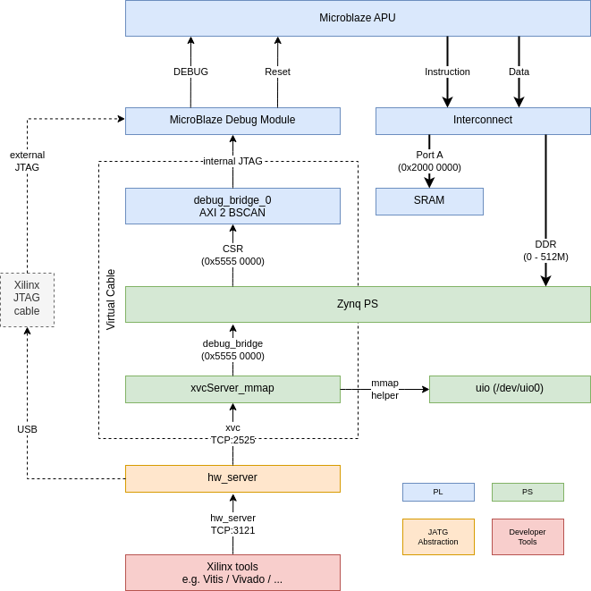

The xvc software is layered and depends on each other. They need to be started in the following order to work:
1. Start xvcServer_mmap
2. Start hw_server and connect to the xvcServer
3. Use the Xilinx tool
   Common point for real or virtual JTAG cable


### Startup seqeunce for Dexter
#### Step 1: Release APU from sleep
Dexter:
```
$ ./load_apu -r
```

#### Step 2: Start the xvc server  
Dexter:
```
$ xvcServer_mmap
INFO: To connect to this xvcServer instance, use url: TCP:analog:2542
```

#### Step 3: Start the hw_server
On a PC with the "Vivado Lab Tools" or full Vivado installation:
```
$ source /tools/Xilinx/Vivado/2021.1/settings64.sh
$ hw_server -e "set auto-open-servers xilinx-xvc:192.168.1.146:2542"

****** Xilinx hw_server v2021.1.1
**** Build date : Jul 28 2021 at 13:43:03
    ** Copyright 1986-2021 Xilinx, Inc. All Rights Reserved.

INFO: hw_server application started
INFO: Use Ctrl-C to exit hw_server application

INFO: To connect to this hw_server instance use url: TCP:bcd-pcw:3121
```

## Debugging in Vitis

### Create a target configuration

- Start Vitis
- Open the project
- Open debug configurations  
  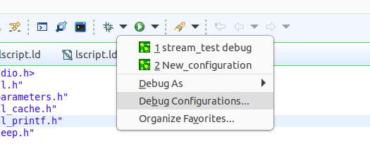
- Select Target Communication Framework  
  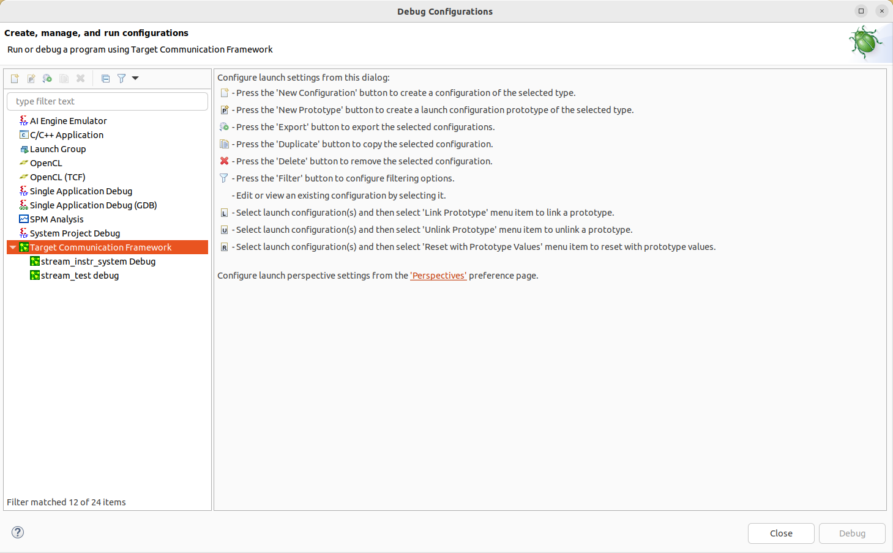
- Add a new configuration  
  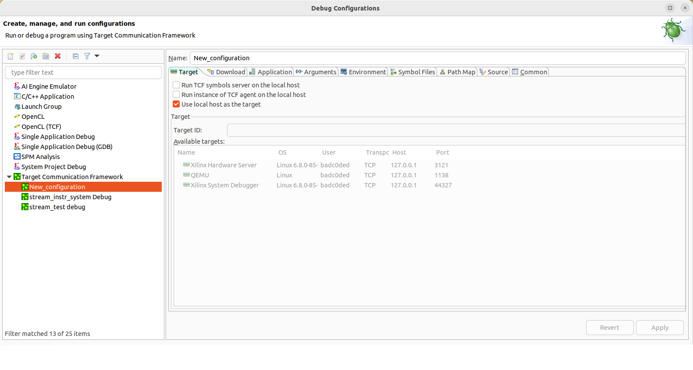
- Unselect "Use local host as the target" and select "Xilinx Hardware Server"  
  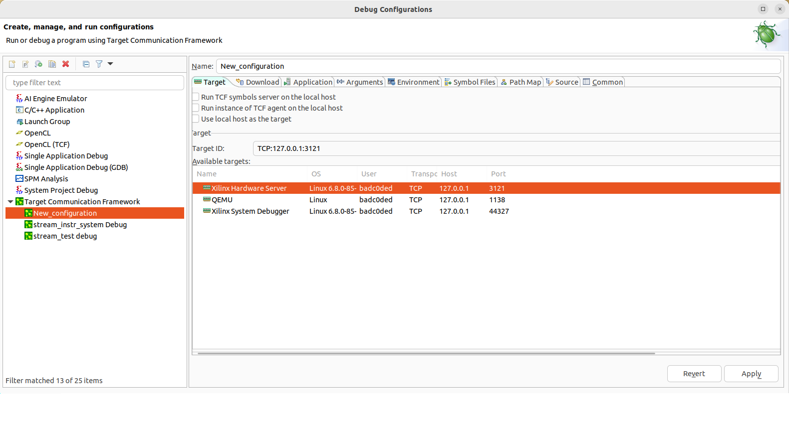
- Goto the "Download" tab and add a new entry  
  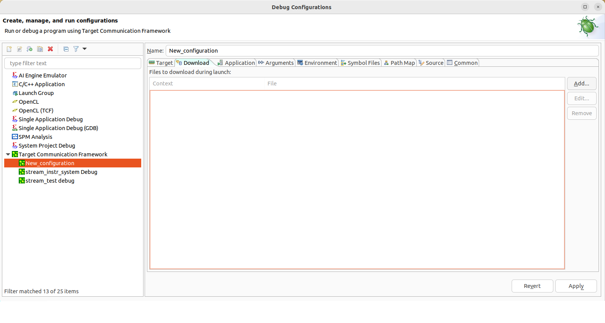
  - Press "Select" to select a context  
    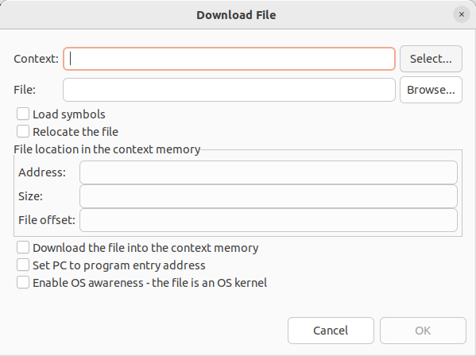
  - Select the Context "Xilinx Hardware Server" and then "Microblaze #0" and press OK  
    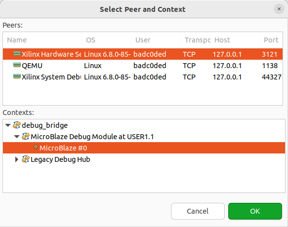
  - Press "Browse" and select an ELF file  
    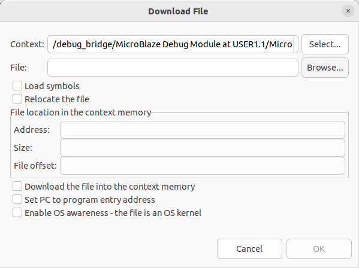
  - Select "Load symbols", "Download the file into the context memory" and "Set PC to program entry address"  
    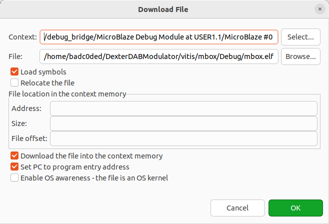  
  - The Download tab has now one entry  
    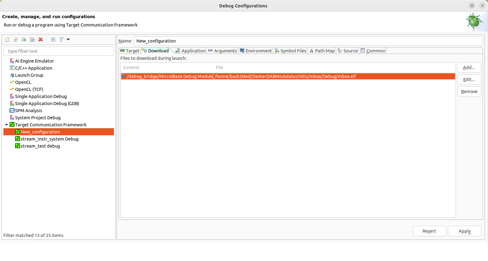
- Go to the "Application" tab  
  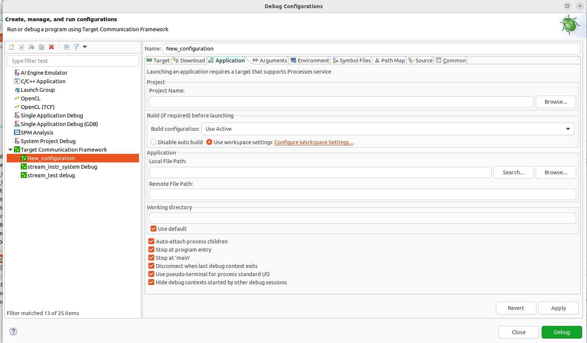
  - Select "Browse" next tot he project name and select the project  
  - Uncheck "Auto-attach process children"
    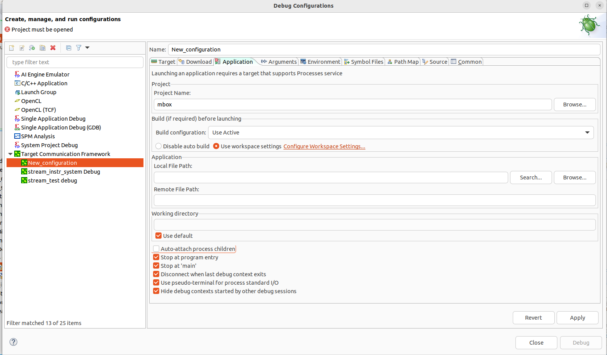
- Rename the configuration and Select Apply

### Run the debugger
- Debug!  
  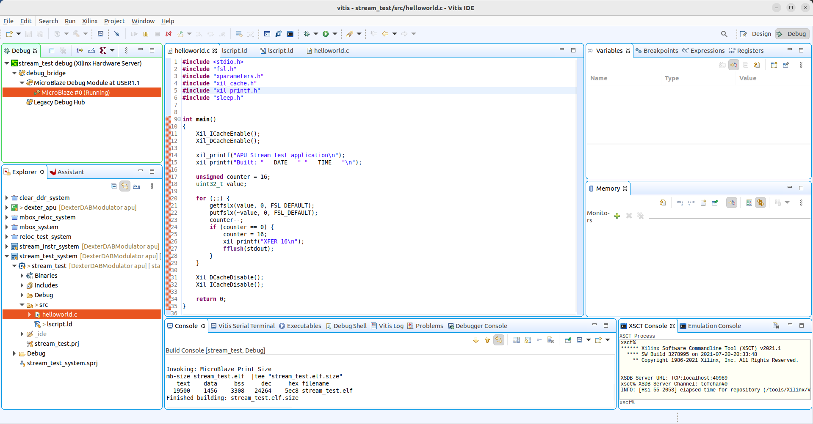
- Pause
  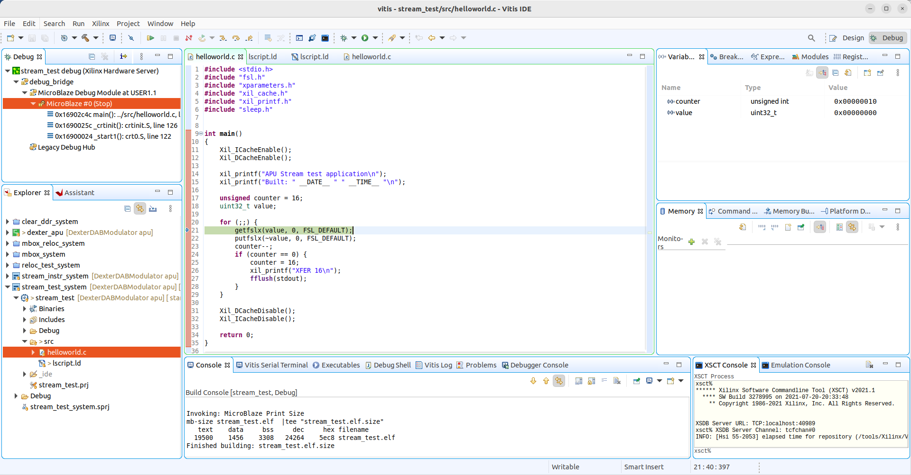
