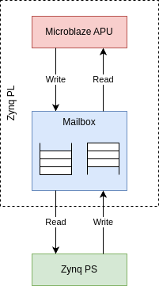

# Mailbox demo (mbox)

The mailbox contains two FIFOs, one in each direction, to communicate between two independent systems over a possible
clock crossing border.



The demo does the following

APU:
- Write message for CPU
- Wait for response from CPU

CPU:
- Wait for message from APU
- Send response to APU

## Demo
### Load APU
```
$ ./load_apu -f mbox.bin
```
```
Page size: 4096 bytes
Assert APU Reset
Loading file mbox.bin
Downloading 5728 bytes to SRAM @ 0x20000000
Release APU Reset
```

### APU debug output
```
$ cat /ttyS0
```
```
---Entering main---
XMbox_LookupConfig OK
XMbox_CfgInitialize OK
MailboxExample_Send OK
```

### CPU side
```
$ ./mbox -d /dev/mem -r -w
```
```
Page size: 4096 bytes
REG_MBOX_STATUS: 0x0000000c
REG_MBOX_ERROR:  0x00000000
REG_MBOX_SIT:    0x00000000
REG_MBOX_RIT:    0x00000000
REG_MBOX_IS:     0x00000003
REG_MBOX_IE:     0x00000000
REG_MBOX_IP:     0x00000000
mbox write....
   0: 6c6c6548 Hell
   4: 5420216f o! T
   8: 43206568 he C
  12: 75736e6f onsu
  16: 2072656d mer 
  20: 65657267 gree
  24: 74207374 ts t
  28: 50206568 he P
  32: 75646f72 rodu
  36: 00726563 cer.
Wrote 40 bytes
mbox read....
   0: 6c6c6548 Hell
   4: 5420216f o! T
   8: 50206568 he P
  12: 75646f72 rodu
  16: 20726563 cer 
  20: 65657267 gree
  24: 74207374 ts t
  28: 43206568 he C
  32: 75736e6f onsu
  36: 0072656d mer.
...done
```

### APU debug output (continued)
```
---Entering main---
XMbox_LookupConfig OK
XMbox_CfgInitialize OK
MailboxExample_Send OK
MailboxExample_Receive OK
MailboxExample_Send OK
```
