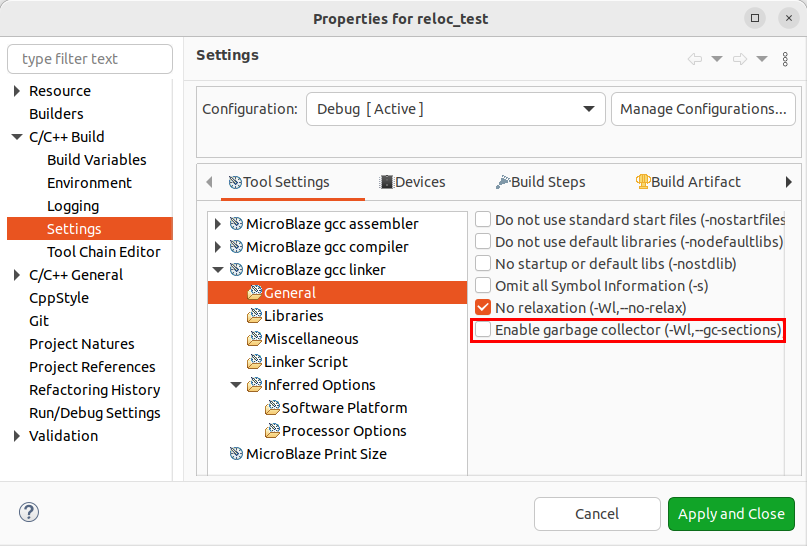
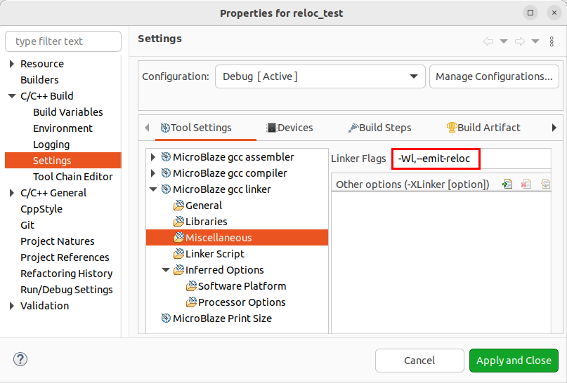
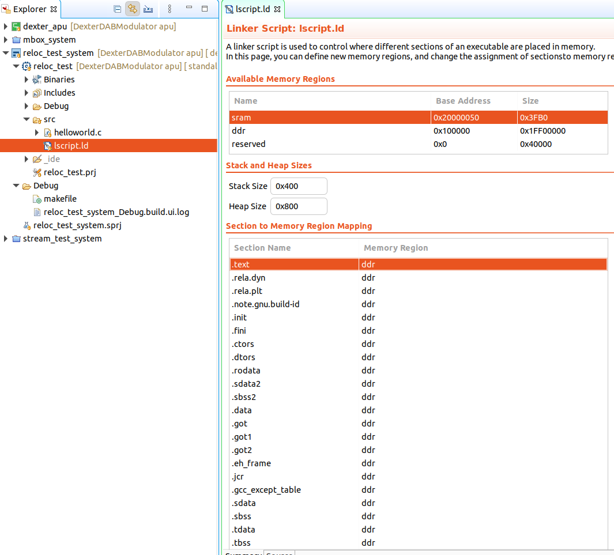
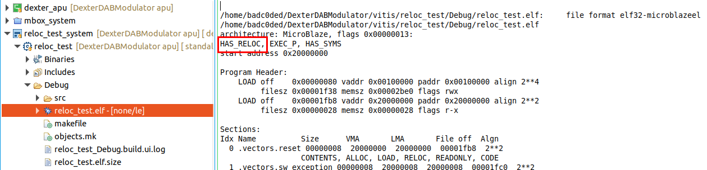

# Relocation test (reloc_test)
- Download ELF file by loader
- Apply ELF relocation by loader
- Running APU program out of relocated PS DDR Memory

The relocation test program is a simple "Hello World" type program. It is linked to run out of PS DDR memory.
Vitis defaults for locate the ELF at address `0x100000`. Unfortunately it is unlikely that we can load the ELF
to this address. We request some DDR memory from the operating system and then load the ELF into it. The second
step is then to fix all memory references to point to the correct address.

## Vitis quirks
The default configuration will not generate the required ELF relocation information.
In the project settings the following things must be set up:
- Add `-Wl,--emit-reloc` to the linker settings  
- Remove `-Wl,--gc-sections` from the linker settings  
- Remove `-Wl,--gc-keep-exported` from linker settings  
  (gcc will sugegst to add this if you only add `-Wl,--emit-reloc` without removing `-Wl,--gc-sections`)




## Linker script
The names in the linker scripts can be renamed to something simple like "`sram` / `ddr` / `reserved` for easier reading.


## Final checks
`HAS_RELOC` must appear in the linked ELF or the load will not work!


## Demo
### Loading ELF
```
./load_apu -f reloc_test.elf
```
```
Page size: 4096 bytes
Assert APU Reset
Loading file reloc_test.elf
Zeroing memory...
  SRAM     0x20000000 - 20003fff
  DDR      0x16900000 - 169fffff
Loading program...
Downloading 7992 bytes to DDR @ 0x16900000
Downloading 40 bytes to SRAM @ 0x20000000
Relocating...
Successfully applied 485 relocations
Release APU Reset
```

### APU debug output
```
$ cat /dev/ttyUL0
```
```
Hello Wold
Successfully ran Hello World application from DDR memory
```

## Debugging

```
$ ./load_apu -f reloc_test.elf -vv
```
```
Page size: 4096 bytes
Assert APU Reset
Loading file reloc_test.elf
Zeroing memory...
  SRAM     0x20000000 - 20003fff
  DDR      0x16900000 - 169fffff
Loading program...
  LOAD off    00000080 vaddr 00100000 paddr 00100000, align 2**16
       filesz 0x00001F38 memsz 0x00002be0 flags 0x7
Downloading 7992 bytes to DDR @ 0x16900000
  LOAD off    00001FB8 vaddr 20000000 paddr 20000000, align 2**4
       filesz 0x00000028 memsz 0x00000028 flags 0x5
Downloading 40 bytes to SRAM @ 0x20000000
Section names table present
Sections:
  Idx Type Name                        Size      ADDR      File off  Flags Align
    0    0                             00000000  00000000  00000000  0000  2**0
    1    1 .vectors.reset              00000008  20000000  00001fb8  0006  2**4
    2    4 .rela.vectors.reset         0000000c  00000000  0001fc1c  0040  2**4
    3    1 .vectors.sw_exception       00000008  20000008  00001fc0  0006  2**4
    4    4 .rela.vectors.sw_exception  0000000c  00000000  0001fc28  0040  2**4
    5    1 .vectors.interrupt          00000008  20000010  00001fc8  0006  2**4
    6    4 .rela.vectors.interrupt     0000000c  00000000  0001fc34  0040  2**4
    7    1 .vectors.hw_exception       00000008  20000020  00001fd8  0006  2**4
    8    4 .rela.vectors.hw_exception  0000000c  00000000  0001fc40  0040  2**4
    9    1 .text                       00001ce4  00100000  00000080  0007  2**16
   10    4 .rela.text                  000015a8  00000000  0001fc4c  0040  2**4
   11    1 .init                       0000003c  00101ce4  00001d64  0006  2**4
   12    4 .rela.init                  00000018  00000000  000211f4  0040  2**4
   13    1 .fini                       00000020  00101d20  00001da0  0006  2**4
   14    4 .rela.fini                  0000000c  00000000  0002120c  0040  2**4
   15    1 .ctors                      00000008  00101d40  00001dc0  0003  2**4
   16    1 .dtors                      00000008  00101d48  00001dc8  0003  2**4
   17    1 .rodata                     00000058  00101d50  00001dd0  0002  2**4
   18    4 .rela.rodata                0000000c  00000000  00021218  0040  2**4
   19    1 .sdata2                     00000000  00101da8  00001fe0  0001  2**1
   20    1 .data                       0000018c  00101da8  00001e28  0003  2**4
   21    4 .rela.data                  000000b4  00000000  00021224  0040  2**4
   22    1 .tm_clone_table             00000000  00101f34  00001fb4  0003  2**4
   23    1 .eh_frame                   00000004  00101f34  00001fb4  0003  2**4
   24    1 .sdata                      00000000  00101f38  00001fe0  0001  2**1
   25    1 .sbss                       00000000  00101f38  00001fe0  0001  2**1
   26    8 .bss                        000000a8  00101f38  00001fb8  0003  2**4
   27    8 .heap                       00000800  00101fe0  00001fb8  0003  2**1
   28    8 .stack                      00000400  001027e0  00001fb8  0003  2**1
   29    1 .debug_line                 00003fe0  00000000  00001fe0  0000  2**1
   30    4 .rela.debug_line            000032dc  00000000  000212d8  0040  2**4
   31    1 .debug_info                 00002885  00000000  00005fc0  0000  2**1
   32    4 .rela.debug_info            00002c64  00000000  000245b4  0040  2**4
   33    1 .debug_abbrev               00000d3b  00000000  00008845  0000  2**1
   34    1 .debug_aranges              000002f0  00000000  00009580  0000  2**8
   35    4 .rela.debug_aranges         000004ec  00000000  00027218  0040  2**4
   36    1 .debug_str                  0000f990  00000000  00009870  0030  2**1
   37    1 .debug_ranges               000004e0  00000000  00019200  0000  2**8
   38    4 .rela.debug_ranges          00000a80  00000000  00027704  0040  2**4
   39    1 .debug_frame                00000440  00000000  000196e0  0000  2**4
   40    4 .rela.debug_frame           0000063c  00000000  00028184  0040  2**4
   41    1 .debug_macro                00002cd2  00000000  00019b20  0000  2**1
   42    4 .rela.debug_macro           00004fa4  00000000  000287c0  0040  2**4
   43    1 .debug_loc                  00001a33  00000000  0001c7f2  0000  2**1
   44    4 .rela.debug_loc             0000282c  00000000  0002d764  0040  2**4
   45    2 .symtab                     00000f10  00000000  0001e228  0000  2**4
   46    3 .strtab                     00000ae1  00000000  0001f138  0000  2**1
   47    3 .shstrtab                   0000019b  00000000  0002ff90  0000  2**1
Relocating...
  RELA in section  2: flags 0040 .rela.vectors.reset
SRAM @ 0000:R_MICROBLAZE_64 (+0): b0000010 -> b0001690, (+4): b8080000 -> b8080000
  Relocation stats: Total 1, Errors: 0
  RELA in section  4: flags 0040 .rela.vectors.sw_exception
SRAM @ 0008:R_MICROBLAZE_64 (+0): b0000010 -> b0001690, (+4): b80808b4 -> b80808b4
  Relocation stats: Total 2, Errors: 0
  RELA in section  6: flags 0040 .rela.vectors.interrupt
SRAM @ 0010:R_MICROBLAZE_64 (+0): b0000010 -> b0001690, (+4): b808095c -> b808095c
  Relocation stats: Total 3, Errors: 0
  RELA in section  8: flags 0040 .rela.vectors.hw_exception
SRAM @ 0020:R_MICROBLAZE_64 (+0): b0000010 -> b0001690, (+4): b8080290 -> b8080290
  Relocation stats: Total 4, Errors: 0
  RELA in section 10: flags 0040 .rela.text
DDR @ 0000:R_MICROBLAZE_64 (+0): b0000010 -> b0001690, (+4): 31a01f38 -> 31a01f38
DDR @ 0008:R_MICROBLAZE_64 (+0): b0000010 -> b0001690, (+4): 30401da8 -> 30401da8
DDR @ 0010:R_MICROBLAZE_64 (+0): b0000010 -> b0001690, (+4): 30202bc0 -> 30202bc0
DDR @ 0018:R_MICROBLAZE_64_PCREL (+0): b0000000 -> b0000000, (+4): b9f401bc -> b9f401bc
DDR @ 0024:R_MICROBLAZE_64_PCREL (+0): b0000000 -> b0000000, (+4): b9f406f8 -> b9f406f8
DDR @ 0034:R_MICROBLAZE_64 (+0): b0000010 -> b0001690, (+4): 30a01f34 -> 30a01f34
DDR @ 003c:R_MICROBLAZE_64 (+0): b0000010 -> b0001690, (+4): 30601f34 -> 30601f34
DDR @ 004c:R_MICROBLAZE_64 (+0): b0000000 -> b0000000, (+4): 30600000 -> 30600000
DDR @ 007c:R_MICROBLAZE_64 (+0): b0000010 -> b0001690, (+4): 30a01f34 -> 30a01f34
DDR @ 0084:R_MICROBLAZE_64 (+0): b0000010 -> b0001690, (+4): 30601f34 -> 30601f34
DDR @ 00a4:R_MICROBLAZE_64 (+0): b0000000 -> b0000000, (+4): 30600000 -> 30600000
DDR @ 00d4:R_MICROBLAZE_64 (+0): b0000010 -> b0001690, (+4): e0601f38 -> e0601f38
DDR @ 00e4:R_MICROBLAZE_64 (+0): b0000010 -> b0001690, (+4): 30601d48 -> 30601d48
DDR @ 00f0:R_MICROBLAZE_64 (+0): b0000010 -> b0001690, (+4): 32601d4c -> 32601d4c
DDR @ 0110:R_MICROBLAZE_64 (+0): b0000010 -> b0001690, (+4): e8601f3c -> e8601f3c
DDR @ 012c:R_MICROBLAZE_64 (+0): b0000000 -> b0000000, (+4): 30600000 -> 30600000
DDR @ 013c:R_MICROBLAZE_64 (+0): b0000010 -> b0001690, (+4): 30a01f34 -> 30a01f34
DDR @ 0144:R_MICROBLAZE_64_PCREL (+0): b000ffef -> b000e96f, (+4): b9f4feb8 -> b9f4feb8
DDR @ 0160:R_MICROBLAZE_64 (+0): b0000010 -> b0001690, (+4): f0601f38 -> f0601f38
DDR @ 0170:R_MICROBLAZE_64 (+0): b0000010 -> b0001690, (+4): f8601f3c -> f8601f3c
DDR @ 0194:R_MICROBLAZE_64 (+0): b0000000 -> b0000000, (+4): 30600000 -> 30600000
DDR @ 01a8:R_MICROBLAZE_64 (+0): b0000010 -> b0001690, (+4): 30c01f40 -> 30c01f40
DDR @ 01b0:R_MICROBLAZE_64 (+0): b0000010 -> b0001690, (+4): 30a01f34 -> 30a01f34
DDR @ 01b8:R_MICROBLAZE_64_PCREL (+0): b000ffef -> b000e96f, (+4): b9f4fe44 -> b9f4fe44
DDR @ 01e0:R_MICROBLAZE_64 (+0): b0000010 -> b0001690, (+4): 20c01f38 -> 20c01f38
DDR @ 01e8:R_MICROBLAZE_64 (+0): b0000010 -> b0001690, (+4): 20e01f38 -> 20e01f38
DDR @ 0208:R_MICROBLAZE_64 (+0): b0000010 -> b0001690, (+4): 20c01f38 -> 20c01f38
DDR @ 0210:R_MICROBLAZE_64 (+0): b0000010 -> b0001690, (+4): 20e01fe0 -> 20e01fe0
DDR @ 0230:R_MICROBLAZE_64_PCREL (+0): b0000000 -> b0000000, (+4): b9f4068c -> b9f4068c
DDR @ 023c:R_MICROBLAZE_64_PCREL (+0): b0000000 -> b0000000, (+4): b9f41aa4 -> b9f41aa4
DDR @ 0250:R_MICROBLAZE_64_PCREL (+0): b0000000 -> b0000000, (+4): b9f406b4 -> b9f406b4
DDR @ 0260:R_MICROBLAZE_64_PCREL (+0): b0000000 -> b0000000, (+4): b9f41abc -> b9f41abc
DDR @ 026c:R_MICROBLAZE_64_PCREL (+0): b0000000 -> b0000000, (+4): b9f40648 -> b9f40648
DDR @ 0290:R_MICROBLAZE_64 (+0): b0000010 -> b0001690, (+4): f8601db4 -> f8601db4
DDR @ 02ac:R_MICROBLAZE_64 (+0): b0000010 -> b0001690, (+4): e8601db4 -> e8601db4
DDR @ 02fc:R_MICROBLAZE_64 (+0): b0000010 -> b0001690, (+4): 30801db8 -> 30801db8
DDR @ 0308:R_MICROBLAZE_64 (+0): b0000010 -> b0001690, (+4): 30c00ab8 -> 30c00ab8
DDR @ 0354:R_MICROBLAZE_64 (+0): b0000010 -> b0001690, (+4): 30801db8 -> 30801db8
DDR @ 03b8:R_MICROBLAZE_64 (+0): b0000010 -> b0001690, (+4): f0c01db0 -> f0c01db0
DDR @ 03d8:R_MICROBLAZE_64 (+0): b0000010 -> b0001690, (+4): f0a01dac -> f0a01dac
DDR @ 03e4:R_MICROBLAZE_64 (+0): b0000010 -> b0001690, (+4): f0a01dad -> f0a01dad
DDR @ 03f0:R_MICROBLAZE_64 (+0): b0000010 -> b0001690, (+4): f0a01dae -> f0a01dae
DDR @ 03fc:R_MICROBLAZE_64 (+0): b0000010 -> b0001690, (+4): f0a01daf -> f0a01daf
DDR @ 0404:R_MICROBLAZE_64 (+0): b0000010 -> b0001690, (+4): e8601dac -> e8601dac
DDR @ 0414:R_MICROBLAZE_64 (+0): b0000010 -> b0001690, (+4): f0a01dac -> f0a01dac
DDR @ 0420:R_MICROBLAZE_64 (+0): b0000010 -> b0001690, (+4): f0a01dad -> f0a01dad
DDR @ 0428:R_MICROBLAZE_64 (+0): b0000010 -> b0001690, (+4): e4601dac -> e4601dac
DDR @ 0430:R_MICROBLAZE_64 (+0): b0000010 -> b0001690, (+4): e0a01db0 -> e0a01db0
DDR @ 0438:R_MICROBLAZE_64 (+0): b0000010 -> b0001690, (+4): 30c00510 -> 30c00510
DDR @ 0454:R_MICROBLAZE_64 (+0): b0000010 -> b0001690, (+4): e0a01db0 -> e0a01db0
DDR @ 045c:R_MICROBLAZE_64 (+0): b0000010 -> b0001690, (+4): 30c00610 -> 30c00610
DDR @ 0484:R_MICROBLAZE_64 (+0): b0000010 -> b0001690, (+4): f8601dac -> f8601dac
DDR @ 048c:R_MICROBLAZE_64 (+0): b0000010 -> b0001690, (+4): e0601dac -> e0601dac
DDR @ 0498:R_MICROBLAZE_64 (+0): b0000010 -> b0001690, (+4): e0601dad -> e0601dad
DDR @ 04a4:R_MICROBLAZE_64 (+0): b0000010 -> b0001690, (+4): e0601dae -> e0601dae
DDR @ 04b0:R_MICROBLAZE_64 (+0): b0000010 -> b0001690, (+4): e0601daf -> e0601daf
DDR @ 04c0:R_MICROBLAZE_64 (+0): b0000010 -> b0001690, (+4): f8601dac -> f8601dac
DDR @ 04c8:R_MICROBLAZE_64 (+0): b0000010 -> b0001690, (+4): e0601dac -> e0601dac
DDR @ 04d4:R_MICROBLAZE_64 (+0): b0000010 -> b0001690, (+4): e0601dad -> e0601dad
DDR @ 0730:R_MICROBLAZE_64_PCREL (+0): b0000000 -> b0000000, (+4): b9f4002c -> b9f4002c
DDR @ 073c:R_MICROBLAZE_64 (+0): b0000010 -> b0001690, (+4): e8a01da4 -> e8a01da4
DDR @ 0754:R_MICROBLAZE_64_PCREL (+0): b000ffff -> b000ffff, (+4): b9f4f8d8 -> b9f4f8d8
DDR @ 0768:R_MICROBLAZE_64 (+0): b0000010 -> b0001690, (+4): eb001da4 -> eb001da4
DDR @ 08d0:R_MICROBLAZE_64 (+0): b0000010 -> b0001690, (+4): 32601d40 -> 32601d40
DDR @ 0918:R_MICROBLAZE_64_PCREL (+0): b000ffff -> b000ffff, (+4): b9f4fdfc -> b9f4fdfc
DDR @ 0924:R_MICROBLAZE_64_PCREL (+0): b000ffff -> b000ffff, (+4): b9f4fde8 -> b9f4fde8
DDR @ 0930:R_MICROBLAZE_64 (+0): b0000010 -> b0001690, (+4): 30a01d50 -> 30a01d50
DDR @ 0938:R_MICROBLAZE_64_PCREL (+0): b0000000 -> b0000000, (+4): b9f400d8 -> b9f400d8
DDR @ 0944:R_MICROBLAZE_64 (+0): b0000010 -> b0001690, (+4): 30a01d60 -> 30a01d60
DDR @ 094c:R_MICROBLAZE_64_PCREL (+0): b0000000 -> b0000000, (+4): b9f400c4 -> b9f400c4
DDR @ 0988:R_MICROBLAZE_64 (+0): b0000010 -> b0001690, (+4): 30601ef0 -> 30601ef0
DDR @ 0a00:R_MICROBLAZE_64 (+0): b0000010 -> b0001690, (+4): 30601ef0 -> 30601ef0
DDR @ 0a34:R_MICROBLAZE_64_PCREL (+0): b0000000 -> b0000000, (+4): b9f41244 -> b9f41244
DDR @ 0a60:R_MICROBLAZE_64 (+0): b0000010 -> b0001690, (+4): e8601f58 -> e8601f58
DDR @ 0a7c:R_MICROBLAZE_64 (+0): b0000010 -> b0001690, (+4): e8601ef8 -> e8601ef8
DDR @ 0a94:R_MICROBLAZE_64 (+0): b0000010 -> b0001690, (+4): e8601ef8 -> e8601ef8
DDR @ 0aa8:R_MICROBLAZE_64 (+0): b0000010 -> b0001690, (+4): f8a01f58 -> f8a01f58
DDR @ 0af0:R_MICROBLAZE_64 (+0): b0000010 -> b0001690, (+4): 30781efc -> 30781efc
DDR @ 0b20:R_MICROBLAZE_64 (+0): b0000010 -> b0001690, (+4): 33181efc -> 33181efc
DDR @ 0b80:R_MICROBLAZE_64 (+0): b0000010 -> b0001690, (+4): 30841f24 -> 30841f24
DDR @ 0b88:R_MICROBLAZE_64 (+0): b0000010 -> b0001690, (+4): 30631efc -> 30631efc
DDR @ 0c2c:R_MICROBLAZE_64_PCREL (+0): b000ffff -> b000ffff, (+4): b9f4fe90 -> b9f4fe90
DDR @ 0c44:R_MICROBLAZE_64 (+0): b0000010 -> b0001690, (+4): 30601efc -> 30601efc
DDR @ 0c68:R_MICROBLAZE_64 (+0): b0000010 -> b0001690, (+4): e8601f00 -> e8601f00
DDR @ 0ca0:R_MICROBLAZE_64 (+0): b0000010 -> b0001690, (+4): f8e31f20 -> f8e31f20
DDR @ 0ca8:R_MICROBLAZE_64 (+0): b0000010 -> b0001690, (+4): f9031f24 -> f9031f24
DDR @ 0cc8:R_MICROBLAZE_64_PCREL (+0): b0000000 -> b0000000, (+4): b9f40abc -> b9f40abc
DDR @ 0d44:R_MICROBLAZE_64 (+0): b0000010 -> b0001690, (+4): 307a1f60 -> 307a1f60
DDR @ 0d60:R_MICROBLAZE_64_PCREL (+0): b0000000 -> b0000000, (+4): b9f40a24 -> b9f40a24
DDR @ 0e0c:R_MICROBLAZE_64_PCREL (+0): b0000000 -> b0000000, (+4): b9f40978 -> b9f40978
DDR @ 0e28:R_MICROBLAZE_64 (+0): b0000010 -> b0001690, (+4): 30a61f60 -> 30a61f60
DDR @ 0eac:R_MICROBLAZE_64 (+0): b0000010 -> b0001690, (+4): f8001f5c -> f8001f5c
DDR @ 0ec0:R_MICROBLAZE_64 (+0): b0000010 -> b0001690, (+4): 30a01d9c -> 30a01d9c
DDR @ 0ed0:R_MICROBLAZE_64_PCREL (+0): b000ffff -> b000ffff, (+4): b9f4fb8c -> b9f4fb8c
DDR @ 0ee4:R_MICROBLAZE_64 (+0): b0000010 -> b0001690, (+4): f8601f5c -> f8601f5c
DDR @ 0f20:R_MICROBLAZE_64 (+0): b0000010 -> b0001690, (+4): f8001f5c -> f8001f5c
DDR @ 0f34:R_MICROBLAZE_64 (+0): b0000010 -> b0001690, (+4): 32c01efc -> 32c01efc
DDR @ 0fb0:R_MICROBLAZE_64 (+0): b0000010 -> b0001690, (+4): 33400ea4 -> 33400ea4
DDR @ 0fb8:R_MICROBLAZE_64 (+0): b0000010 -> b0001690, (+4): 33000ab8 -> 33000ab8
DDR @ 0fcc:R_MICROBLAZE_64 (+0): b0000010 -> b0001690, (+4): f8ab1f60 -> f8ab1f60
DDR @ 0fd4:R_MICROBLAZE_64 (+0): b0000010 -> b0001690, (+4): fa6a1f24 -> fa6a1f24
DDR @ 0ff0:R_MICROBLAZE_64 (+0): b0000010 -> b0001690, (+4): 30891efc -> 30891efc
DDR @ 1014:R_MICROBLAZE_64 (+0): b0000010 -> b0001690, (+4): fb491f20 -> fb491f20
DDR @ 101c:R_MICROBLAZE_64 (+0): b0000010 -> b0001690, (+4): f8ab1f60 -> f8ab1f60
DDR @ 1024:R_MICROBLAZE_64 (+0): b0000010 -> b0001690, (+4): fa6a1f24 -> fa6a1f24
DDR @ 1058:R_MICROBLAZE_64 (+0): b0000010 -> b0001690, (+4): e8601fdc -> e8601fdc
DDR @ 1100:R_MICROBLAZE_64 (+0): b0000010 -> b0001690, (+4): 30a01d9c -> 30a01d9c
DDR @ 1108:R_MICROBLAZE_64_PCREL (+0): b000ffff -> b000ffff, (+4): b9f4f954 -> b9f4f954
DDR @ 1118:R_MICROBLAZE_64 (+0): b0000010 -> b0001690, (+4): f8601f5c -> f8601f5c
DDR @ 1138:R_MICROBLAZE_64 (+0): b0000010 -> b0001690, (+4): f8001f5c -> f8001f5c
DDR @ 1194:R_MICROBLAZE_64 (+0): b0000010 -> b0001690, (+4): 30a01d9c -> 30a01d9c
DDR @ 119c:R_MICROBLAZE_64_PCREL (+0): b000ffff -> b000ffff, (+4): b9f4f8c0 -> b9f4f8c0
DDR @ 11a8:R_MICROBLAZE_64 (+0): b0000010 -> b0001690, (+4): fa601f5c -> fa601f5c
DDR @ 11c4:R_MICROBLAZE_64 (+0): b0000010 -> b0001690, (+4): 30a01d9c -> 30a01d9c
DDR @ 11cc:R_MICROBLAZE_64_PCREL (+0): b000ffff -> b000ffff, (+4): b9f4f890 -> b9f4f890
DDR @ 11dc:R_MICROBLAZE_64 (+0): b0000010 -> b0001690, (+4): fa601f5c -> fa601f5c
DDR @ 11f4:R_MICROBLAZE_64 (+0): b0000010 -> b0001690, (+4): 30a01d9c -> 30a01d9c
DDR @ 11fc:R_MICROBLAZE_64_PCREL (+0): b000ffff -> b000ffff, (+4): b9f4f860 -> b9f4f860
DDR @ 120c:R_MICROBLAZE_64 (+0): b0000010 -> b0001690, (+4): f8601f5c -> f8601f5c
DDR @ 122c:R_MICROBLAZE_64 (+0): b0000010 -> b0001690, (+4): f8001f5c -> f8001f5c
DDR @ 1258:R_MICROBLAZE_64 (+0): b0000010 -> b0001690, (+4): 30a01d9c -> 30a01d9c
DDR @ 1260:R_MICROBLAZE_64_PCREL (+0): b000ffff -> b000ffff, (+4): b9f4f7fc -> b9f4f7fc
DDR @ 1274:R_MICROBLAZE_64 (+0): b0000010 -> b0001690, (+4): f8601f5c -> f8601f5c
DDR @ 1284:R_MICROBLAZE_64 (+0): b0000010 -> b0001690, (+4): 30a01d9c -> 30a01d9c
DDR @ 128c:R_MICROBLAZE_64_PCREL (+0): b000ffff -> b000ffff, (+4): b9f4f7d0 -> b9f4f7d0
DDR @ 129c:R_MICROBLAZE_64 (+0): b0000010 -> b0001690, (+4): f8601f5c -> f8601f5c
DDR @ 12bc:R_MICROBLAZE_64 (+0): b0000010 -> b0001690, (+4): f8001f5c -> f8001f5c
DDR @ 1318:R_MICROBLAZE_64 (+0): b0000010 -> b0001690, (+4): 30a01d9c -> 30a01d9c
DDR @ 1320:R_MICROBLAZE_64_PCREL (+0): b000ffff -> b000ffff, (+4): b9f4f73c -> b9f4f73c
DDR @ 1330:R_MICROBLAZE_64 (+0): b0000010 -> b0001690, (+4): fa601f5c -> fa601f5c
DDR @ 1348:R_MICROBLAZE_64 (+0): b0000010 -> b0001690, (+4): 30a01d9c -> 30a01d9c
DDR @ 1350:R_MICROBLAZE_64_PCREL (+0): b000ffff -> b000ffff, (+4): b9f4f70c -> b9f4f70c
DDR @ 1360:R_MICROBLAZE_64 (+0): b0000010 -> b0001690, (+4): fa601f5c -> fa601f5c
DDR @ 1378:R_MICROBLAZE_64 (+0): b0000010 -> b0001690, (+4): 30a01d9c -> 30a01d9c
DDR @ 1380:R_MICROBLAZE_64_PCREL (+0): b000ffff -> b000ffff, (+4): b9f4f6dc -> b9f4f6dc
DDR @ 1390:R_MICROBLAZE_64 (+0): b0000010 -> b0001690, (+4): f8601f5c -> f8601f5c
DDR @ 13a0:R_MICROBLAZE_64 (+0): b0000010 -> b0001690, (+4): 30a01d9c -> 30a01d9c
DDR @ 13a8:R_MICROBLAZE_64_PCREL (+0): b000ffff -> b000ffff, (+4): b9f4f6b4 -> b9f4f6b4
DDR @ 13b4:R_MICROBLAZE_64 (+0): b0000010 -> b0001690, (+4): fa601f5c -> fa601f5c
DDR @ 13d4:R_MICROBLAZE_64 (+0): b0000010 -> b0001690, (+4): f8001f5c -> f8001f5c
DDR @ 1408:R_MICROBLAZE_64 (+0): b0000010 -> b0001690, (+4): 30631f60 -> 30631f60
DDR @ 142c:R_MICROBLAZE_64 (+0): b0000010 -> b0001690, (+4): 30800ea4 -> 30800ea4
DDR @ 1454:R_MICROBLAZE_64 (+0): b0000010 -> b0001690, (+4): 30a01d9c -> 30a01d9c
DDR @ 145c:R_MICROBLAZE_64_PCREL (+0): b000ffff -> b000ffff, (+4): b9f4f600 -> b9f4f600
DDR @ 146c:R_MICROBLAZE_64 (+0): b0000010 -> b0001690, (+4): fa601f5c -> fa601f5c
DDR @ 1480:R_MICROBLAZE_64 (+0): b0000010 -> b0001690, (+4): 30a01d9c -> 30a01d9c
DDR @ 1488:R_MICROBLAZE_64_PCREL (+0): b000ffff -> b000ffff, (+4): b9f4f5d4 -> b9f4f5d4
DDR @ 1498:R_MICROBLAZE_64 (+0): b0000010 -> b0001690, (+4): fa601f5c -> fa601f5c
DDR @ 14ac:R_MICROBLAZE_64 (+0): b0000010 -> b0001690, (+4): 30a01d9c -> 30a01d9c
DDR @ 14b4:R_MICROBLAZE_64_PCREL (+0): b000ffff -> b000ffff, (+4): b9f4f5a8 -> b9f4f5a8
DDR @ 14c4:R_MICROBLAZE_64 (+0): b0000010 -> b0001690, (+4): f8601f5c -> f8601f5c
DDR @ 14e4:R_MICROBLAZE_64 (+0): b0000010 -> b0001690, (+4): f8001f5c -> f8001f5c
DDR @ 1514:R_MICROBLAZE_64 (+0): b0000010 -> b0001690, (+4): 30c61f60 -> 30c61f60
DDR @ 153c:R_MICROBLAZE_64 (+0): b0000010 -> b0001690, (+4): 30a01d9c -> 30a01d9c
DDR @ 1544:R_MICROBLAZE_64_PCREL (+0): b000ffff -> b000ffff, (+4): b9f4f518 -> b9f4f518
DDR @ 1554:R_MICROBLAZE_64 (+0): b0000010 -> b0001690, (+4): fa601f5c -> fa601f5c
DDR @ 1568:R_MICROBLAZE_64 (+0): b0000010 -> b0001690, (+4): 30a01d9c -> 30a01d9c
DDR @ 1570:R_MICROBLAZE_64_PCREL (+0): b000ffff -> b000ffff, (+4): b9f4f4ec -> b9f4f4ec
DDR @ 1580:R_MICROBLAZE_64 (+0): b0000010 -> b0001690, (+4): fa601f5c -> fa601f5c
DDR @ 1594:R_MICROBLAZE_64 (+0): b0000010 -> b0001690, (+4): 30a01d9c -> 30a01d9c
DDR @ 159c:R_MICROBLAZE_64_PCREL (+0): b000ffff -> b000ffff, (+4): b9f4f4c0 -> b9f4f4c0
DDR @ 15ac:R_MICROBLAZE_64 (+0): b0000010 -> b0001690, (+4): f8601f5c -> f8601f5c
DDR @ 15cc:R_MICROBLAZE_64 (+0): b0000010 -> b0001690, (+4): f8001f5c -> f8001f5c
DDR @ 15fc:R_MICROBLAZE_64 (+0): b0000010 -> b0001690, (+4): 30c61f60 -> 30c61f60
DDR @ 1628:R_MICROBLAZE_64 (+0): b0000010 -> b0001690, (+4): 30a01d9c -> 30a01d9c
DDR @ 1630:R_MICROBLAZE_64_PCREL (+0): b000ffff -> b000ffff, (+4): b9f4f42c -> b9f4f42c
DDR @ 1640:R_MICROBLAZE_64 (+0): b0000010 -> b0001690, (+4): fa601f5c -> fa601f5c
DDR @ 1654:R_MICROBLAZE_64 (+0): b0000010 -> b0001690, (+4): 30a01d9c -> 30a01d9c
DDR @ 165c:R_MICROBLAZE_64_PCREL (+0): b000ffff -> b000ffff, (+4): b9f4f400 -> b9f4f400
DDR @ 166c:R_MICROBLAZE_64 (+0): b0000010 -> b0001690, (+4): fa601f5c -> fa601f5c
DDR @ 1680:R_MICROBLAZE_64 (+0): b0000010 -> b0001690, (+4): 30a01d9c -> 30a01d9c
DDR @ 1688:R_MICROBLAZE_64_PCREL (+0): b000ffff -> b000ffff, (+4): b9f4f3d4 -> b9f4f3d4
DDR @ 1698:R_MICROBLAZE_64 (+0): b0000010 -> b0001690, (+4): f8601f5c -> f8601f5c
DDR @ 16b8:R_MICROBLAZE_64 (+0): b0000010 -> b0001690, (+4): f8001f5c -> f8001f5c
DDR @ 16e4:R_MICROBLAZE_64 (+0): b0000010 -> b0001690, (+4): 30c61f60 -> 30c61f60
DDR @ 1708:R_MICROBLAZE_64 (+0): b0000010 -> b0001690, (+4): 30a01d9c -> 30a01d9c
DDR @ 1710:R_MICROBLAZE_64_PCREL (+0): b000ffff -> b000ffff, (+4): b9f4f34c -> b9f4f34c
DDR @ 1720:R_MICROBLAZE_64 (+0): b0000010 -> b0001690, (+4): fa601f5c -> fa601f5c
DDR @ 1734:R_MICROBLAZE_64 (+0): b0000010 -> b0001690, (+4): 30a01d9c -> 30a01d9c
DDR @ 173c:R_MICROBLAZE_64_PCREL (+0): b000ffff -> b000ffff, (+4): b9f4f320 -> b9f4f320
DDR @ 174c:R_MICROBLAZE_64 (+0): b0000010 -> b0001690, (+4): fa601f5c -> fa601f5c
DDR @ 1760:R_MICROBLAZE_64 (+0): b0000010 -> b0001690, (+4): 30a01d9c -> 30a01d9c
DDR @ 1768:R_MICROBLAZE_64_PCREL (+0): b000ffff -> b000ffff, (+4): b9f4f2f4 -> b9f4f2f4
DDR @ 1778:R_MICROBLAZE_64 (+0): b0000010 -> b0001690, (+4): f8601f5c -> f8601f5c
DDR @ 1788:R_MICROBLAZE_64 (+0): b0000010 -> b0001690, (+4): 30601efc -> 30601efc
DDR @ 17d4:R_MICROBLAZE_64 (+0): b0000010 -> b0001690, (+4): f8001f5c -> f8001f5c
DDR @ 1820:R_MICROBLAZE_64 (+0): b0000010 -> b0001690, (+4): 311a1f60 -> 311a1f60
DDR @ 1868:R_MICROBLAZE_64_PCREL (+0): b000ffff -> b000ffff, (+4): b9f4fc68 -> b9f4fc68
DDR @ 187c:R_MICROBLAZE_64 (+0): b0000010 -> b0001690, (+4): 30a01d9c -> 30a01d9c
DDR @ 1884:R_MICROBLAZE_64_PCREL (+0): b000ffff -> b000ffff, (+4): b9f4f1d8 -> b9f4f1d8
DDR @ 1890:R_MICROBLAZE_64 (+0): b0000010 -> b0001690, (+4): fae01f5c -> fae01f5c
DDR @ 18c0:R_MICROBLAZE_64 (+0): b0000010 -> b0001690, (+4): 30a01d9c -> 30a01d9c
DDR @ 18c8:R_MICROBLAZE_64_PCREL (+0): b000ffff -> b000ffff, (+4): b9f4f194 -> b9f4f194
DDR @ 18d4:R_MICROBLAZE_64 (+0): b0000010 -> b0001690, (+4): fae01f5c -> fae01f5c
DDR @ 1900:R_MICROBLAZE_64_PCREL (+0): b000ffff -> b000ffff, (+4): b9f4fcb8 -> b9f4fcb8
DDR @ 191c:R_MICROBLAZE_64 (+0): b0000010 -> b0001690, (+4): 30a01d9c -> 30a01d9c
DDR @ 1924:R_MICROBLAZE_64_PCREL (+0): b000ffff -> b000ffff, (+4): b9f4f138 -> b9f4f138
DDR @ 1930:R_MICROBLAZE_64 (+0): b0000010 -> b0001690, (+4): fae01f5c -> fae01f5c
DDR @ 1940:R_MICROBLAZE_64 (+0): b0000010 -> b0001690, (+4): 30a01d9c -> 30a01d9c
DDR @ 1948:R_MICROBLAZE_64_PCREL (+0): b000ffff -> b000ffff, (+4): b9f4f114 -> b9f4f114
DDR @ 1958:R_MICROBLAZE_64 (+0): b0000010 -> b0001690, (+4): f8601f5c -> f8601f5c
DDR @ 1968:R_MICROBLAZE_64 (+0): b0000010 -> b0001690, (+4): 30a01d9c -> 30a01d9c
DDR @ 1970:R_MICROBLAZE_64_PCREL (+0): b000ffff -> b000ffff, (+4): b9f4f0ec -> b9f4f0ec
DDR @ 197c:R_MICROBLAZE_64 (+0): b0000010 -> b0001690, (+4): fae01f5c -> fae01f5c
DDR @ 19a4:R_MICROBLAZE_64 (+0): b0000010 -> b0001690, (+4): f8001f5c -> f8001f5c
DDR @ 19e8:R_MICROBLAZE_64 (+0): b0000010 -> b0001690, (+4): 30631f60 -> 30631f60
DDR @ 1a60:R_MICROBLAZE_64_PCREL (+0): b000ffff -> b000ffff, (+4): b9f4fa70 -> b9f4fa70
DDR @ 1a74:R_MICROBLAZE_64 (+0): b0000010 -> b0001690, (+4): 30a01d9c -> 30a01d9c
DDR @ 1a7c:R_MICROBLAZE_64_PCREL (+0): b000ffff -> b000ffff, (+4): b9f4efe0 -> b9f4efe0
DDR @ 1a88:R_MICROBLAZE_64 (+0): b0000010 -> b0001690, (+4): fac01f5c -> fac01f5c
DDR @ 1aa8:R_MICROBLAZE_64 (+0): b0000010 -> b0001690, (+4): 30a01d9c -> 30a01d9c
DDR @ 1ab0:R_MICROBLAZE_64_PCREL (+0): b000ffff -> b000ffff, (+4): b9f4efac -> b9f4efac
DDR @ 1ac0:R_MICROBLAZE_64 (+0): b0000010 -> b0001690, (+4): fac01f5c -> fac01f5c
DDR @ 1b0c:R_MICROBLAZE_64_PCREL (+0): b000ffff -> b000ffff, (+4): b9f4faac -> b9f4faac
DDR @ 1b24:R_MICROBLAZE_64 (+0): b0000010 -> b0001690, (+4): 30a01d9c -> 30a01d9c
DDR @ 1b2c:R_MICROBLAZE_64_PCREL (+0): b000ffff -> b000ffff, (+4): b9f4ef30 -> b9f4ef30
DDR @ 1b3c:R_MICROBLAZE_64 (+0): b0000010 -> b0001690, (+4): fac01f5c -> fac01f5c
DDR @ 1b58:R_MICROBLAZE_64 (+0): b0000010 -> b0001690, (+4): 30a01d9c -> 30a01d9c
DDR @ 1b60:R_MICROBLAZE_64_PCREL (+0): b000ffff -> b000ffff, (+4): b9f4eefc -> b9f4eefc
DDR @ 1b70:R_MICROBLAZE_64 (+0): b0000010 -> b0001690, (+4): f8601f5c -> f8601f5c
DDR @ 1b98:R_MICROBLAZE_64 (+0): b0000010 -> b0001690, (+4): f8001f5c -> f8001f5c
DDR @ 1bc0:R_MICROBLAZE_64 (+0): b0000010 -> b0001690, (+4): 30801efc -> 30801efc
DDR @ 1bec:R_MICROBLAZE_64 (+0): b0000010 -> b0001690, (+4): 30a51f60 -> 30a51f60
DDR @ 1c2c:R_MICROBLAZE_64 (+0): b0000010 -> b0001690, (+4): 30c61f60 -> 30c61f60
DDR @ 1c54:R_MICROBLAZE_64 (+0): b0000010 -> b0001690, (+4): 30a01d9c -> 30a01d9c
DDR @ 1c5c:R_MICROBLAZE_64_PCREL (+0): b000ffff -> b000ffff, (+4): b9f4ee00 -> b9f4ee00
DDR @ 1c6c:R_MICROBLAZE_64 (+0): b0000010 -> b0001690, (+4): f8601f5c -> f8601f5c
DDR @ 1c90:R_MICROBLAZE_64_PCREL (+0): b0000000 -> b0000000, (+4): b9f40014 -> b9f40014
  Relocation stats: Total 466, Errors: 0
  RELA in section 12: flags 0040 .rela.init
DDR @ 1cfc:R_MICROBLAZE_64_PCREL (+0): b000ffff -> b000ffff, (+4): b9f4e494 -> b9f4e494
DDR @ 1d08:R_MICROBLAZE_64_PCREL (+0): b000ffff -> b000ffff, (+4): b9f4ebbc -> b9f4ebbc
  Relocation stats: Total 468, Errors: 0
  RELA in section 14: flags 0040 .rela.fini
DDR @ 1d28:R_MICROBLAZE_64_PCREL (+0): b000ffff -> b000ffff, (+4): b9f4e3a8 -> b9f4e3a8
  Relocation stats: Total 469, Errors: 0
  RELA in section 18: flags 0040 .rela.rodata
DDR @ 1da4:R_MICROBLAZE_32: 00101dfc -> 16901dfc
  Relocation stats: Total 470, Errors: 0
  RELA in section 21: flags 0040 .rela.data
DDR @ 1db8:R_MICROBLAZE_32: 00100ab8 -> 16900ab8
DDR @ 1dc0:R_MICROBLAZE_32: 00100ab8 -> 16900ab8
DDR @ 1dc8:R_MICROBLAZE_32: 00100ab8 -> 16900ab8
DDR @ 1dd0:R_MICROBLAZE_32: 00100ab8 -> 16900ab8
DDR @ 1dd8:R_MICROBLAZE_32: 00100ab8 -> 16900ab8
DDR @ 1de0:R_MICROBLAZE_32: 00100ab8 -> 16900ab8
DDR @ 1de8:R_MICROBLAZE_32: 00100ab8 -> 16900ab8
DDR @ 1df0:R_MICROBLAZE_32: 00100ab8 -> 16900ab8
DDR @ 1df8:R_MICROBLAZE_32: 00101dfc -> 16901dfc
DDR @ 1e00:R_MICROBLAZE_32: 00000000 -> 00000000
DDR @ 1e04:R_MICROBLAZE_32: 00000000 -> 00000000
DDR @ 1e08:R_MICROBLAZE_32: 00000000 -> 00000000
DDR @ 1ef0:R_MICROBLAZE_32: 00100ac0 -> 16900ac0
DDR @ 1f20:R_MICROBLAZE_32: 00100ab8 -> 16900ab8
DDR @ 1f28:R_MICROBLAZE_32: 00100ab8 -> 16900ab8
  Relocation stats: Total 485, Errors: 0
  RELA in section 30: flags 0040 .rela.debug_line
  Relocation stats: Total 485, Errors: 0
  RELA in section 32: flags 0040 .rela.debug_info
  Relocation stats: Total 485, Errors: 0
  RELA in section 35: flags 0040 .rela.debug_aranges
  Relocation stats: Total 485, Errors: 0
  RELA in section 38: flags 0040 .rela.debug_ranges
  Relocation stats: Total 485, Errors: 0
  RELA in section 40: flags 0040 .rela.debug_frame
  Relocation stats: Total 485, Errors: 0
  RELA in section 42: flags 0040 .rela.debug_macro
  Relocation stats: Total 485, Errors: 0
  RELA in section 44: flags 0040 .rela.debug_loc
  Relocation stats: Total 485, Errors: 0
Successfully applied 485 relocations
Release APU Reset
```