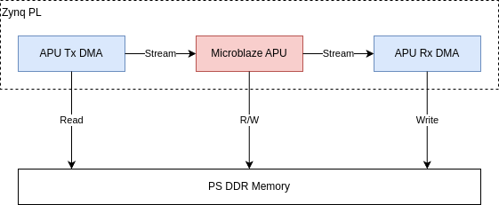

# Stream test (stream_test)

- Running APU program out of PS DDR Memory
- Reading and writing AXI stream data
- Using the Tx and Rx DMA from Zynq

The stream test application processes AXI stream data and runs out of the PS DDR memory.
The processing done in the APU is a simple inversion of the bit pattern.
Every 16 words the APU outputs 'XFER 16' on the debug console.



## Setup
```
./load_apu -f stream_test.elf
```
```
Page size: 4096 bytes
Assert APU Reset
Loading file stream_test.elf
Zeroing memory...
  SRAM     0x20000000 - 20003fff
  DDR      0x16900000 - 169fffff
Loading program...
Downloading 19484 bytes to DDR @ 0x16900000
Downloading 1440 bytes to DDR @ 0x16904c20
Downloading 40 bytes to SRAM @ 0x20000000
Relocating...
Successfully applied 1402 relocations
Release APU Reset
```

## Demo
### Sender
```
cat mbox.bin | iio_writedev apu0_tx -b8
```

### Receiver
```
iio_readdev -b8 -T0 > mbox_i.bin
```


### APU
```
APU Stream test application
Built: Oct  2 2025 16:07:59
XFER 16
XFER 16
XFER 16
...
```

## Check
### Original Data (mbox.bin)
```
00000000  00 20 00 b0 50 00 08 b8  00 20 00 b0 3c 07 08 b8  |. ..P.... ..<...|
00000010  00 20 00 b0 a0 0a 08 b8  00 00 00 00 00 00 00 00  |. ..............|
00000020  00 20 00 b0 d8 02 08 b8  00 00 00 00 00 00 00 00  |. ..............|
00000030  00 00 00 00 00 00 00 00  00 00 00 00 00 00 00 00  |................|
```

### Inverted Data (mbox_i.bin)
```
00000000  ff df ff 4f af ff f7 47  ff df ff 4f c3 f8 f7 47  |...O...G...O...G|
00000010  ff df ff 4f 5f f5 f7 47  ff ff ff ff ff ff ff ff  |...O_..G........|
00000020  ff df ff 4f 27 fd f7 47  ff ff ff ff ff ff ff ff  |...O'..G........|
00000030  ff ff ff ff ff ff ff ff  ff ff ff ff ff ff ff ff  |................|
```

