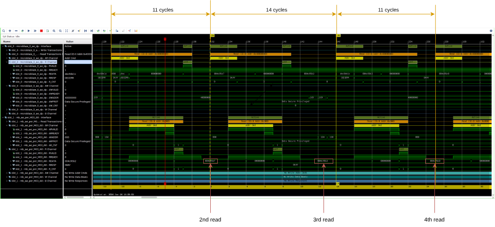

# APU Timestamp counter

The tsc is an 48-bit counter that runs with the cpu clock. The counter value is connected to an AXI GPIO block.
The lower 32-Bits are connected to the GPIO port and the upper 16 bits are connected to the GPIO2 port.

The 32-bit counter part will overflow after 42.94967295 seconds. It is usually not required to check the upper 16 bits
if the timed section takes less than that.

[Tsc circuit](./tsc.pdf)

## Memory map
| Address       | Content    |
| ------------- | ---------- |
| `0x4000 0000` | tsc[31:0]  |
| `0x4000 0008` | tsc[47:32] |

## Verification

### Program
```c
    xil_printf("\r\nTimestamp counter test #3\r\n");

    uint32_t tsc_vals[16];

    asm volatile(
        "lwi r5, %0, 0\n"           // read tsc[31:0] and store in r5
        "lwi r6, %0, 0\n"           // read tsc[31:0] and store in r6
        "swi r5, %1, 0\n"           // store r5 in tsc_vals[0]
        "swi r6, %1, 4\n"           // store r6 in tsc_vals[1]
        "lwi r5, %0, 0\n"
        "lwi r6, %0, 0\n"
        "swi r5, %1, 8\n"           // store r5 in tsc_vals[2]
        "swi r6, %1, 12\n"          // store r6 in tsc_vals[3]
        "lwi r5, %0, 0\n"
        "lwi r6, %0, 0\n"
        "swi r5, %1, 16\n"          // store r5 in tsc_vals[4]
        "swi r6, %1, 20\n"          // store r6 in tsc_vals[5]
        "lwi r5, %0, 0\n"
        "lwi r6, %0, 0\n"
        "swi r5, %1, 24\n"          // store r5 in tsc_vals[6]
        "swi r6, %1, 28\n"          // store r6 in tsc_vals[7]
        "lwi r5, %0, 0\n"
        "lwi r6, %0, 0\n"
        "swi r5, %1, 32\n"          // store r5 in tsc_vals[8]
        "swi r6, %1, 36\n"          // store r6 in tsc_vals[9]
        "lwi r5, %0, 0\n"
        "lwi r6, %0, 0\n"
        "swi r5, %1, 40\n"          // store r5 in tsc_vals[10]
        "swi r6, %1, 44\n"          // store r6 in tsc_vals[11]
        "lwi r5, %0, 0\n"
        "lwi r6, %0, 0\n"
        "swi r5, %1, 48\n"          // store r5 in tsc_vals[12]
        "swi r6, %1, 52\n"          // store r6 in tsc_vals[13]
        "lwi r5, %0, 0\n"
        "lwi r6, %0, 0\n"
        "swi r5, %1, 56\n"          // store r5 in tsc_vals[14]
        "swi r6, %1, 60\n"          // store r6 in tsc_vals[15]
        : : "r"(0x40000000), "r"(&tsc_vals[0])
        );

    for(int i=0; i<14; i++) {
        xil_printf("Timestamp counter: 0x%08x - 0x%08x = %d\r\n", tsc_vals[i+1], tsc_vals[i], tsc_vals[i+1] - tsc_vals[i]);
    }
```


### Program output
```
Timestamp counter test #3
Timestamp counter: 0x004C95B2 - 0x004C95A7 = 11
Timestamp counter: 0x004C95C0 - 0x004C95B2 = 14
Timestamp counter: 0x004C95CB - 0x004C95C0 = 11
Timestamp counter: 0x004C95D9 - 0x004C95CB = 14
Timestamp counter: 0x004C95E4 - 0x004C95D9 = 11
```

### Bus Trace
[Hi res](./screenshots/tsc_ila2.png)  


### Checks

| Counter value | Clk # | Delta clk | output                                            | result |
| ------------- | ----- | --------- | ------------------------------------------------- | ------ |
| `0x004c95a7`  | 121   |           |                                                   |        |
| `0x004c95b2`  | 132   | 11        | `Timestamp counter: 0x004C95B2 - 0x004C95A7 = 11` | ok     |
| `0x004c95c0`  | 146   | 14        | `Timestamp counter: 0x004C95C0 - 0x004C95B2 = 14` | ok     |
| n/a           | 157   | 11        | `Timestamp counter: 0x004C95CB - 0x004C95C0 = 11` | ok     |

