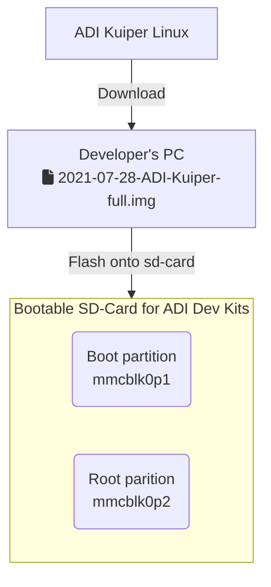
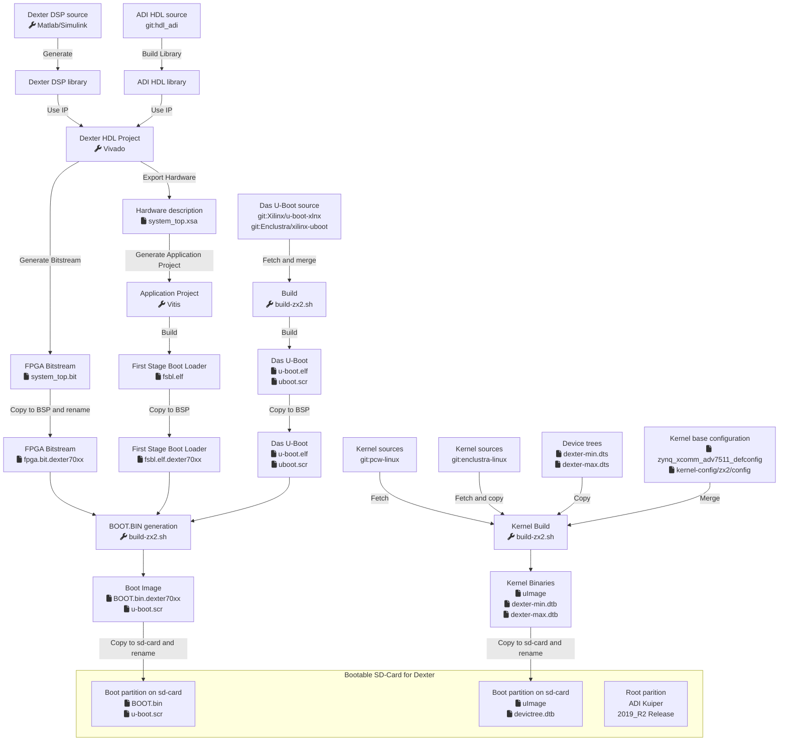

# Dexter BSP

The Dexter BSP contains information how to build each file required to boot
the Enclustra Mars ZX2 FPGA module on the Dexter from sd-card.

## Overview

0. [ADI Kuiper Linux as Base](kuiper_sdcard.md)
1. [fpga.bit - Build the FPGA Bitstream](build_hdl.md)
2. [fsbl.elf - Build the First Stage Boot Loader](build_fsbl.md)
3. [u-boot.elf and uboot.scr - Build Das U-Boot bootloader](build_bsp_uboot.md)
4. [boot.bin - Build combined zynq PS/PL boot image](build_bsp_boot_bin.md)
5. [uImage and devicetree.dtb - Build the Kernel and Device tree](build_bsp_kernel.md)
6. [What to copy to the sd-card's BOOT parition](build_bsp_sdboot.md)

## Flow
### Base system


### Dexter specific


## Tools

Tested combination:  
- Ubuntu 18.04.6 LTS x86-64

Downloaded Tools:  
| sha1sum                                  | Package                                      | Version                                   |
| ---------------------------------------- | -------------------------------------------- | ----------------------------------------- |
| bf69cb2eb6feaa90ab61db311cc77143efcd0180 | arm-none-linux-gnueabi-static-i686.tar.bz2   | arm-none-linux-gnueabi-gcc (GCC) 7.2.0    |
| d96d8f2aa6218bc07fa40aff07654689ed85713e | device-tree-compiler-i686-static.tar.gz      | DTC 1.4.1-g8b927bf3-dirty                 |
| cee1d3d7bfeb2bb4e2890e62208a2168838f120f | mkbootimage-e3796c3.tar.gz                   | mkbootimage 2.2-e3796c3                   |
| fe57f1f99c6146f6018fdc0e219c375a03721e4d | uboot-tools-i686-static.tar.gz               | mkimage version 2015.01-g898bf01-dirty    |

## One-time preparation

### General compilers and Tools

1. Install build dependencies  
`sudo apt install -y autoconf build-essential libc6-i386 libssl-dev flex bison curl`

2. Fetch the build tools  
```
cd <dexter git repo>/bsp_pcw
./get-env.sh
```

3. Fetch pcw-linux and enclustra-linux sources
```
cd <dexter git repo>/bsp_pcw/KERNEL
./fetch.sh
```
