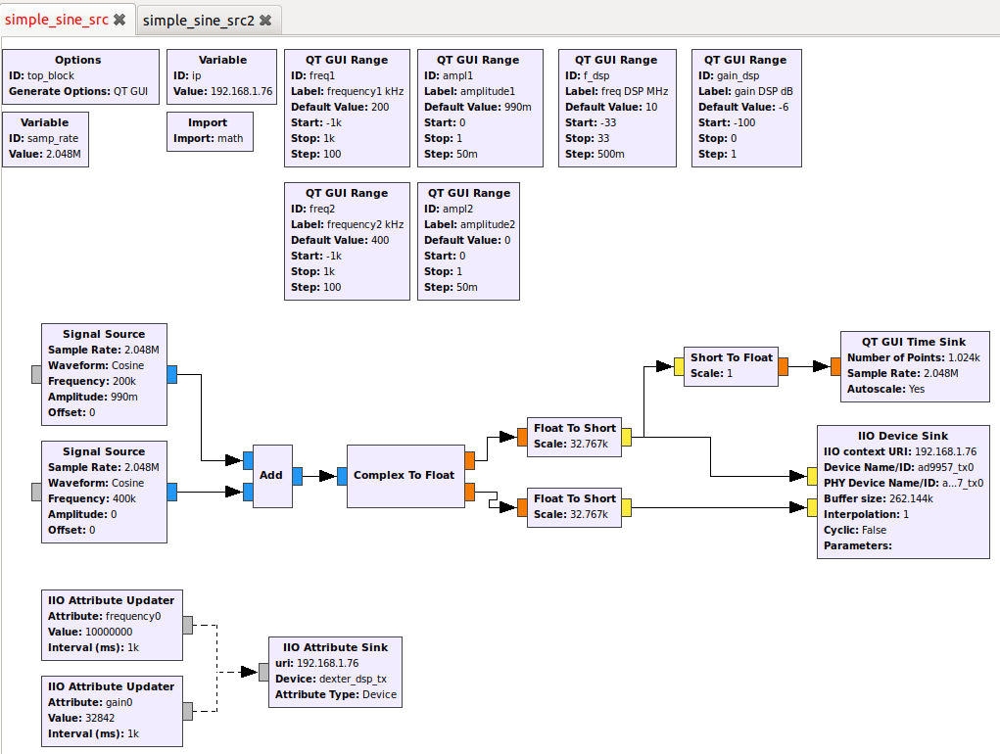
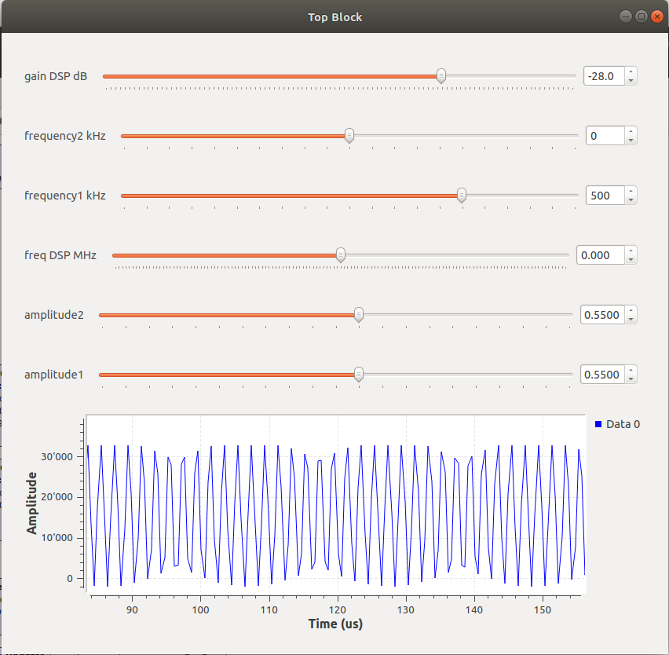
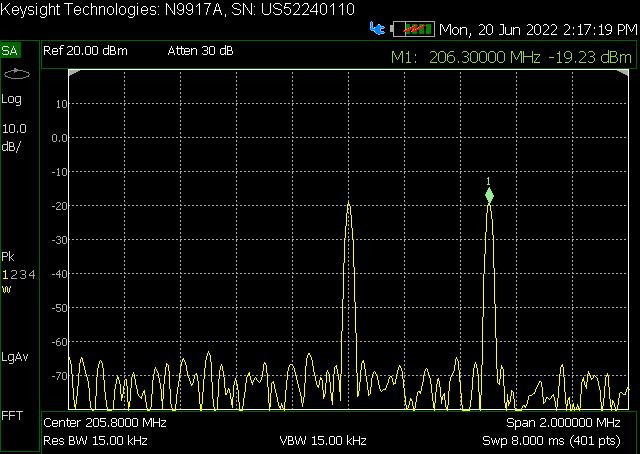

# Dexter GNU Radio Examples

## Tools

Tested combination:
- Ubuntu 18.04.6 LTS
- GNU Radio Companion 3.7.13.4

## Examples

| Example Design    | Description                                       |
| ----------------- | --------------------------------------------------|
| simple_sine_src   | Simple Sine Source on Tx DMA #0 (ad9957_tx0)      |
| simple_sine_src2  | Simple Sine Source on Tx DMA #1 (ad9957_tx1)      |

### Simple Sine Source

Example: simple_sine_src

`iio_attr -d ad9957 center_frequency 205800000`

