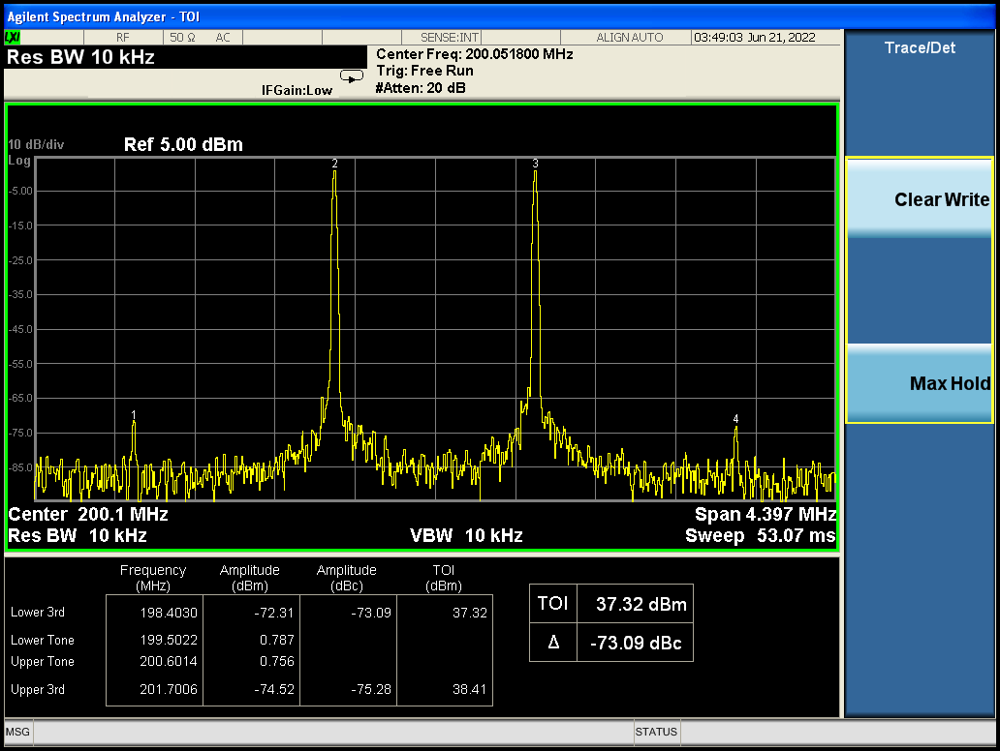

# Third order intercept point
`iio_attr -d dexter_dsp_tx dc0 10000`

`iio_attr -d dexter_dsp_tx dc1 10000`

`iio_attr -d dexter_dsp_tx -- frequency0 -5300000`

`iio_attr -d dexter_dsp_tx -- frequency0 -4200000`

